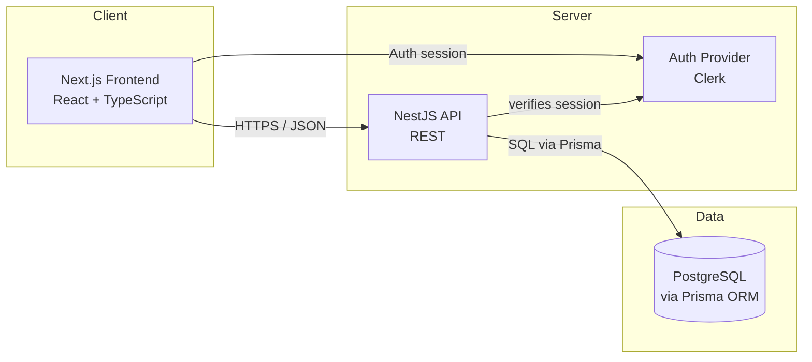
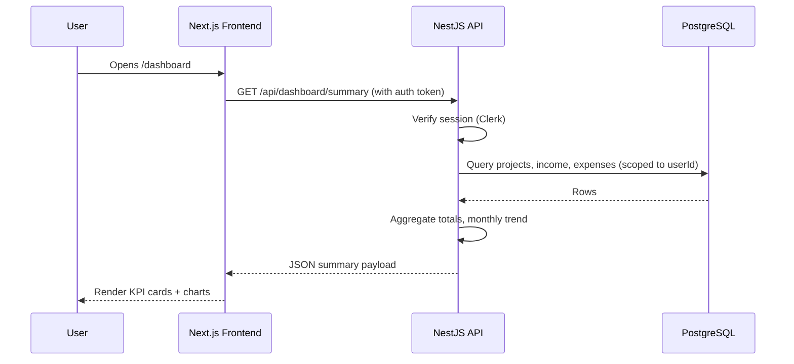

# System Architecture
## Project Finance Dashboard

**Related documents:** 01-Product-Requirements-Document.md, 03-Database-Design.md, 04-API-Specification.md, 07-Deployment-and-DevOps.md

---

## 1. Overview

The system is a modular monolith: a single Next.js frontend and a single NestJS backend API, backed by one PostgreSQL database. This is intentionally simple for a single-user MVP, while the data model and API are structured so the same architecture can grow into a multi-tenant SaaS product later (Section 9).

## 2. Architecture Principles

- **Simple first.** No microservices, no queues, no caching layer for MVP — a single API and single database is enough for one user's data volume.
- **Tenant-ready from day one.** Every table that holds user data includes a `userId` foreign key, even though there's only one user today.
- **Typed end-to-end.** TypeScript on both frontend and backend, with Prisma-generated types as the shared contract, removes an entire class of integration bugs.
- **Calculated, not stored.** Profit and totals are always derived from income/expense records, never manually entered, so they can't drift out of sync.

## 3. High-Level Architecture

## 4. Component Breakdown

### 4.1 Frontend — Next.js
Renders the dashboard, project/client management screens, and reports. Talks to the backend exclusively over a typed REST client. Owns all charting (Recharts) and UI state.

### 4.2 Backend API — NestJS
Owns all business logic: CRUD for projects/clients/income/expenses, profit calculations, dashboard aggregation, and report generation. Structured into feature modules — see `05-Frontend-Architecture.md` for the frontend equivalent, `04-API-Specification.md` for the contract.

### 4.3 Database — PostgreSQL + Prisma
Single relational database. Prisma provides the schema, migrations, and a type-safe query client shared by the NestJS backend.

### 4.4 Authentication — Clerk
Handles sign-in and session management. Marked optional for the earliest MVP milestone (a hardcoded single-user stub is acceptable to start — see `plan.md` Phase 0), but required before any deployment reachable from the public internet.

### 4.5 Hosting / Infra
Frontend on Vercel, backend on Railway, database on Neon — full detail in `07-Deployment-and-DevOps.md`.

## 5. Data Flow — Example: Loading the Dashboard

## 6. Technology Stack & Rationale

| Layer | Technology | Why |
|---|---|---|
| Frontend framework | Next.js + TypeScript | File-based routing, strong ecosystem, good fit for a dashboard-style app |
| Styling | Tailwind CSS + shadcn/ui | Fast, consistent UI without building a design system from scratch |
| Server state | TanStack Query | Handles caching, loading/error states, refetching for API data |
| Charts | Recharts | Composable React charting, sufficient for dashboard and report visuals |
| Backend framework | NestJS | Opinionated module/controller/service structure that scales better than a bare Express app as features grow |
| ORM | Prisma | Type-safe queries, migrations, and a schema that doubles as documentation |
| Database | PostgreSQL (via Neon) | Relational integrity for financial data; Neon's free tier fits a personal project |
| Auth | Clerk | Managed auth — no need to hand-build password/session handling |

## 7. Environment Strategy

| Environment | Purpose | Notes |
|---|---|---|
| Local | Development on the builder's machine | Local Postgres or a Neon dev branch |
| Preview | Per-pull-request preview deploys | Vercel preview + Neon branch database |
| Production | Live, personal-use instance | Single production database; backups enabled |

## 8. Security Architecture

- All traffic over HTTPS (enforced by Vercel/Railway by default).
- Session/auth tokens verified on every API request; no endpoint trusts a client-supplied `userId`.
- Secrets (database URL, Clerk keys) live in environment variables per environment, never in source control.
- Database credentials scoped to the application user only.
- Input validation at the API boundary (class-validator DTOs in NestJS) rejects malformed requests before they reach business logic.

## 9. Scalability & Path to Multi-Tenant SaaS

The MVP is single-user, but several decisions are made specifically so a future multi-user pivot is additive, not a rewrite:

- Every `Project`, `Client`, `Income`, and `Expense` row already carries a `userId` foreign key.
- API routes already scope every query by the authenticated user's ID, never a global query.
- Clerk already supports multi-user out of the box — no auth migration needed.
- The eventual step to SaaS becomes: add team/organization tables, add role-based permissions, relax the "one user owns everything" assumption. See `08-Future-Features.md` §5.

## 10. Error Handling & Logging Strategy

- Backend uses a global NestJS exception filter returning a consistent error shape (`04-API-Specification.md` §4).
- Errors are logged server-side with enough context to reproduce (request path, userId, timestamp), without logging full financial payloads to third-party sinks unnecessarily.
- Frontend surfaces API errors via toast notifications and inline form errors; network failures show a retry affordance (native to TanStack Query).

## 11. Third-Party Integrations

| Service | Purpose | MVP or Future |
|---|---|---|
| Clerk | Authentication | MVP (recommended) |
| Vercel | Frontend hosting | MVP |
| Railway | Backend hosting | MVP |
| Neon | Managed PostgreSQL | MVP |
| Cloudflare R2 | File/attachment storage | Future |

## 12. Key Architecture Decisions

| Decision | Rationale |
|---|---|
| Modular monolith over microservices | One user, low data volume — microservices add operational overhead with no current benefit |
| Derive profit at query time rather than storing it | Prevents stored totals from silently drifting out of sync with underlying records |
| `userId` on every table from day one | Cheapest possible insurance against a painful SaaS migration later |
| REST over GraphQL | Smaller surface area to build and document for a small, well-known set of screens |
| npm-workspaces monorepo (frontend + backend in one repo) | Simpler for a solo builder than coordinating two repos; still deploys as two independent services (see `07-Deployment-and-DevOps.md`) |
