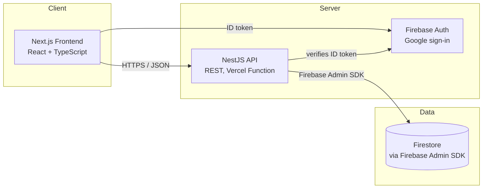
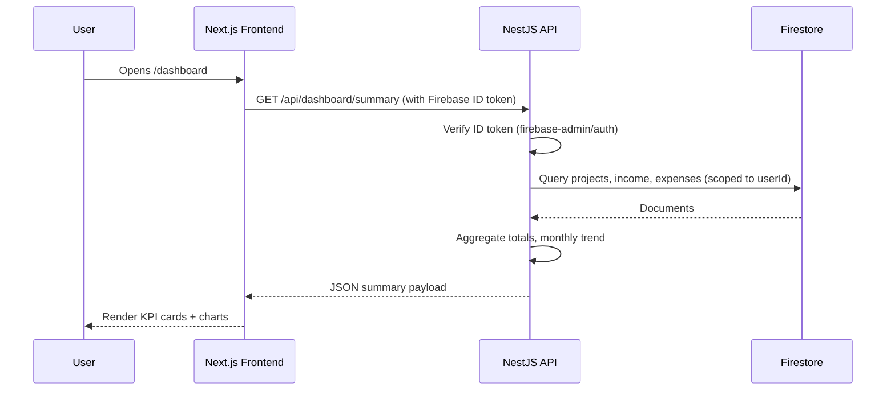

# System Architecture
## Project Finance Dashboard

**Related documents:** 01-Product-Requirements-Document.md, 03-Database-Design.md, 04-API-Specification.md, 07-Deployment-and-DevOps.md

---

## 1. Overview

> **Implementation note:** the sections below describe the *original* design (PostgreSQL via Prisma, Clerk auth, Vercel + Railway + Neon hosting). The build diverged from this during Phase 5/6: the backend runs on **Firestore** (via the Firebase Admin SDK) with **Firebase Auth** (Google sign-in), and both apps deploy to **Vercel** — no Railway, no Neon, no Clerk. See `apps/api/src/firebase/` for the actual data-access layer and `apps/api/src/auth/firebase-auth.guard.ts` for the actual auth guard. The diagrams and tables below are updated to match; the historical rationale (why relational, why Clerk) is left in `08-Future-Features.md` context where relevant, but treat this doc as describing what's actually deployed.

The system is a modular monolith: a single Next.js frontend and a single NestJS backend API, backed by Firestore (a serverless NoSQL document database). This is intentionally simple for a single-user MVP, while the data model and API are structured so the same architecture can grow into a multi-tenant SaaS product later (Section 9).

## 2. Architecture Principles

- **Simple first.** No microservices, no queues, no caching layer for MVP — a single API and one Firestore database is enough for one user's data volume.
- **Tenant-ready from day one.** Every document that holds user data includes a `userId` field, even though there's only one user today.
- **Typed end-to-end.** TypeScript on both frontend and backend, with shared hand-written interfaces (`Project`, `Client`, `Income`, `Expense`) as the contract, removes an entire class of integration bugs.
- **Calculated, not stored.** Profit and totals are always derived from income/expense records, never manually entered, so they can't drift out of sync.

## 3. High-Level Architecture

## 4. Component Breakdown

### 4.1 Frontend — Next.js
Renders the dashboard, project/client management screens, and reports. Talks to the backend exclusively over a typed REST client. Owns all charting (Recharts) and UI state, and talks to Firebase Auth directly (`firebase/auth`) for sign-in.

### 4.2 Backend API — NestJS
Owns all business logic: CRUD for projects/clients/income/expenses, profit calculations, dashboard aggregation, and report generation. Structured into feature modules — see `05-Frontend-Architecture.md` for the frontend equivalent, `04-API-Specification.md` for the contract.

### 4.3 Database — Firestore
Single Firestore database, four collections (`clients`, `projects`, `income`, `expenses`), accessed through the Firebase Admin SDK (`apps/api/src/firebase/firebase.service.ts`). No ORM, no migrations — schema is enforced at the API boundary via `class-validator` DTOs, not the database. Full detail in `03-Database-Design.md`.

### 4.4 Authentication — Firebase Auth
Handles sign-in (Google provider) and ID token issuance on the frontend; the backend verifies each request's bearer token via `firebase-admin/auth` (`apps/api/src/auth/firebase-auth.guard.ts`) and never trusts a client-supplied `userId`.

### 4.5 Hosting / Infra
Both frontend and backend deploy to Vercel — the backend runs as a Vercel serverless function (Node.js runtime) rather than a long-lived server. Full detail in `07-Deployment-and-DevOps.md`.

## 5. Data Flow — Example: Loading the Dashboard

## 6. Technology Stack & Rationale

| Layer | Technology | Why |
|---|---|---|
| Frontend framework | Next.js + TypeScript | File-based routing, strong ecosystem, good fit for a dashboard-style app |
| Styling | Tailwind CSS | Fast, consistent UI without building a design system from scratch |
| Server state | TanStack Query | Handles caching, loading/error states, refetching for API data |
| Charts | Recharts | Composable React charting, sufficient for dashboard and report visuals |
| Backend framework | NestJS | Opinionated module/controller/service structure that scales better than a bare Express app as features grow |
| Data access | Firebase Admin SDK | Typed Firestore client; no separate ORM/migration tooling needed for a document database |
| Database | Firestore | Serverless NoSQL, scales to zero, pairs naturally with Firebase Auth and Vercel functions |
| Auth | Firebase Auth (Google) | Managed auth — no need to hand-build password/session handling; frontend talks to it directly |

## 7. Environment Strategy

| Environment | Purpose | Notes |
|---|---|---|
| Local | Development on the builder's machine | Same Firestore project as production, or the Firebase emulator suite |
| Preview | Per-pull-request preview deploys | Vercel preview deploy; same Firestore project (no per-branch database — see §12 caveat) |
| Production | Live, personal-use instance | Single Firestore database |

## 8. Security Architecture

- All traffic over HTTPS (enforced by Vercel by default).
- ID tokens verified on every API request via `firebase-admin/auth`; no endpoint trusts a client-supplied `userId`.
- Secrets (Firebase service account credentials) live in environment variables per environment, never in source control.
- The Firebase service account used by the backend should be scoped to this project only.
- Input validation at the API boundary (class-validator DTOs in NestJS) rejects malformed requests before they reach business logic.

## 9. Scalability & Path to Multi-Tenant SaaS

The MVP is single-user, but several decisions are made specifically so a future multi-user pivot is additive, not a rewrite:

- Every `project`, `client`, `income`, and `expense` document already carries a `userId` field.
- API routes already scope every query by the authenticated user's ID, never a global query.
- Firebase Auth already supports multi-user out of the box — no auth migration needed.
- The eventual step to SaaS becomes: add a `teams`/`organizations` collection, add role-based permissions, relax the "one user owns everything" assumption. See `08-Future-Features.md` §5.

## 10. Error Handling & Logging Strategy

- Backend relies on NestJS's default exception handling (standard `{ statusCode, message, error }` shape) — there is no custom exception filter yet; `04-API-Specification.md` §4 documents the actual shape.
- Errors are logged server-side with enough context to reproduce (request path, userId, timestamp), without logging full financial payloads to third-party sinks unnecessarily.
- Frontend surfaces API errors via toast notifications and inline form errors; network failures show a retry affordance (native to TanStack Query) plus a styled `ErrorState` component with a retry button.

## 11. Third-Party Integrations

| Service | Purpose | MVP or Future |
|---|---|---|
| Firebase Auth | Authentication | MVP |
| Firestore | Database | MVP |
| Vercel | Frontend + backend hosting | MVP |
| Cloudflare R2 | File/attachment storage | Future |

## 12. Key Architecture Decisions

| Decision | Rationale |
|---|---|
| Modular monolith over microservices | One user, low data volume — microservices add operational overhead with no current benefit |
| Derive profit at query time rather than storing it | Prevents stored totals from silently drifting out of sync with underlying records |
| `userId` on every document from day one | Cheapest possible insurance against a painful SaaS migration later |
| REST over GraphQL | Smaller surface area to build and document for a small, well-known set of screens |
| npm-workspaces monorepo (frontend + backend in one repo) | Simpler for a solo builder than coordinating two repos; still deploys as two independent Vercel projects (see `07-Deployment-and-DevOps.md`) |
| Firestore over Prisma/PostgreSQL (mid-build pivot) | Removed the need for a separately-hosted database and connection pooling on serverless; trade-off is losing relational integrity and needing **composite indexes created manually** for compound queries — see `07-Deployment-and-DevOps.md` §6 caveat, currently unresolved |
