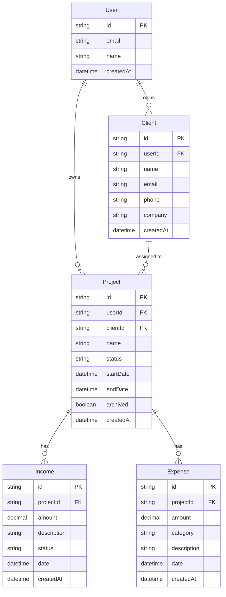

# Database Design
## Project Finance Dashboard

**Related documents:** 02-System-Architecture.md, 04-API-Specification.md

---

## 1. Overview

PostgreSQL via Prisma ORM. A single owner (`User`) has many `Project`s and `Client`s; each `Project` has many `Income` and `Expense` records. A `User` row exists from day one — even though the MVP only ever has one — so the schema needs no structural change for multi-user support later.

## 2. Entity Relationship Diagram



## 3. Table Definitions

### 3.1 User
| Column | Type | Constraints |
|---|---|---|
| id | String (cuid) | PK |
| email | String | Unique, not null |
| name | String | Nullable |
| createdAt | DateTime | Default now() |

### 3.2 Client
| Column | Type | Constraints |
|---|---|---|
| id | String (cuid) | PK |
| userId | String | FK → User.id, not null |
| name | String | Not null |
| email | String | Nullable |
| phone | String | Nullable |
| company | String | Nullable |
| createdAt | DateTime | Default now() |

### 3.3 Project
| Column | Type | Constraints |
|---|---|---|
| id | String (cuid) | PK |
| userId | String | FK → User.id, not null |
| clientId | String | FK → Client.id, nullable |
| name | String | Not null |
| status | Enum: `active`, `completed`, `on_hold` | Default `active` |
| startDate | DateTime | Nullable |
| endDate | DateTime | Nullable |
| archived | Boolean | Default false |
| createdAt | DateTime | Default now() |

### 3.4 Income
| Column | Type | Constraints |
|---|---|---|
| id | String (cuid) | PK |
| projectId | String | FK → Project.id, not null |
| amount | Decimal(10,2) | Not null, > 0 |
| description | String | Nullable |
| status | Enum: `pending`, `paid`, `overdue` | Default `pending` |
| date | DateTime | Not null |
| createdAt | DateTime | Default now() |

### 3.5 Expense
| Column | Type | Constraints |
|---|---|---|
| id | String (cuid) | PK |
| projectId | String | FK → Project.id, not null |
| amount | Decimal(10,2) | Not null, > 0 |
| category | Enum: `hosting`, `domain`, `api_usage`, `software_subscription`, `freelancer`, `marketing`, `miscellaneous` | Not null |
| description | String | Nullable |
| date | DateTime | Not null |
| createdAt | DateTime | Default now() |

## 4. Relationships Summary

- `User` 1—N `Client`, `User` 1—N `Project` (ownership; enables future multi-tenancy)
- `Client` 1—N `Project` (a client can have multiple projects; a project has at most one client)
- `Project` 1—N `Income`
- `Project` 1—N `Expense`
- Child deletes are guarded: deleting a `Project` is **restricted** while it has `Income`/`Expense` rows — use `archived` instead of a hard delete to preserve financial history (FR-1.3).

## 5. Indexes

| Table | Index | Reason |
|---|---|---|
| Project | `(userId, archived)` | Dashboard/list queries always filter by owner and archived state |
| Project | `(clientId)` | Client detail page loads a client's projects |
| Income | `(projectId, date)` | Project detail and monthly reports range-query by date |
| Expense | `(projectId, date)` | Same as above |
| Expense | `(category)` | Expense breakdown report groups by category |

## 6. Prisma Schema

```prisma
// schema.prisma

generator client {
  provider = "prisma-client-js"
}

datasource db {
  provider = "postgresql"
  url      = env("DATABASE_URL")
}

model User {
  id        String    @id @default(cuid())
  email     String    @unique
  name      String?
  createdAt DateTime  @default(now())
  clients   Client[]
  projects  Project[]
}

model Client {
  id        String    @id @default(cuid())
  userId    String
  user      User      @relation(fields: [userId], references: [id])
  name      String
  email     String?
  phone     String?
  company   String?
  createdAt DateTime  @default(now())
  projects  Project[]

  @@index([userId])
}

enum ProjectStatus {
  active
  completed
  on_hold
}

model Project {
  id        String        @id @default(cuid())
  userId    String
  user      User          @relation(fields: [userId], references: [id])
  clientId  String?
  client    Client?       @relation(fields: [clientId], references: [id])
  name      String
  status    ProjectStatus @default(active)
  startDate DateTime?
  endDate   DateTime?
  archived  Boolean       @default(false)
  createdAt DateTime      @default(now())
  income    Income[]
  expenses  Expense[]

  @@index([userId, archived])
  @@index([clientId])
}

enum IncomeStatus {
  pending
  paid
  overdue
}

model Income {
  id          String       @id @default(cuid())
  projectId   String
  project     Project      @relation(fields: [projectId], references: [id])
  amount      Decimal      @db.Decimal(10, 2)
  description String?
  status      IncomeStatus @default(pending)
  date        DateTime
  createdAt   DateTime     @default(now())

  @@index([projectId, date])
}

enum ExpenseCategory {
  hosting
  domain
  api_usage
  software_subscription
  freelancer
  marketing
  miscellaneous
}

model Expense {
  id          String          @id @default(cuid())
  projectId   String
  project     Project         @relation(fields: [projectId], references: [id])
  amount      Decimal         @db.Decimal(10, 2)
  category    ExpenseCategory
  description String?
  date        DateTime
  createdAt   DateTime        @default(now())

  @@index([projectId, date])
  @@index([category])
}
```

## 7. Migration Strategy

- Use `prisma migrate dev` locally to generate migrations as the schema evolves.
- Commit every migration file to version control — never edit a migration that's already been applied to production.
- Apply migrations in production with `prisma migrate deploy` as an explicit deploy step (`07-Deployment-and-DevOps.md` §6).

## 8. Data Validation Rules

- `amount` on Income/Expense must be > 0 — validated at the API layer, not just documented here.
- `Project.endDate`, if set, must be ≥ `startDate`.
- A `Project` cannot be deleted while it has `Income` or `Expense` records — archive instead (enforced by Prisma's default `onDelete: Restrict`).

## 9. Sample Seed Data

```ts
// prisma/seed.ts
import { PrismaClient } from '@prisma/client';
const prisma = new PrismaClient();

async function main() {
  const user = await prisma.user.create({
    data: { email: 'you@example.com', name: 'Solo Dev' },
  });

  const client = await prisma.client.create({
    data: { userId: user.id, name: 'Acme Corp', email: 'billing@acme.com' },
  });

  const project = await prisma.project.create({
    data: {
      userId: user.id,
      clientId: client.id,
      name: 'Acme Website Redesign',
      status: 'active',
      startDate: new Date('2026-06-01'),
    },
  });

  await prisma.income.create({
    data: { projectId: project.id, amount: 2000, description: 'Down payment', status: 'paid', date: new Date('2026-06-01') },
  });

  await prisma.expense.create({
    data: { projectId: project.id, amount: 20, category: 'domain', description: 'Domain renewal', date: new Date('2026-06-02') },
  });

  console.log('Seeded user id:', user.id);
}

main().finally(() => prisma.$disconnect());
```
