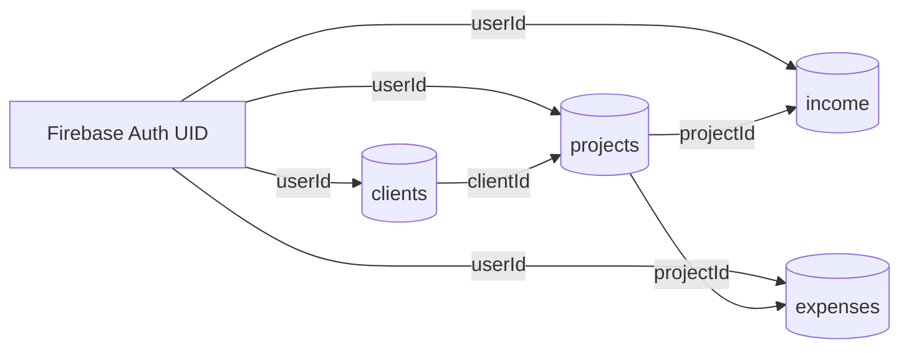

# Database Design
## Project Finance Dashboard

**Related documents:** 02-System-Architecture.md, 04-API-Specification.md

---

> **Implementation note:** this doc originally specified a PostgreSQL/Prisma relational schema. The build pivoted to **Firestore** (a NoSQL document database, accessed via the Firebase Admin SDK) during Phase 5/6. There is no `User` table — Firebase Auth is the user directory, and every document simply stores the Firebase Auth UID in a `userId` field. This doc now describes the actual Firestore data model in `apps/api/src/firebase/collections.ts` and the collection services (`clients.service.ts`, `projects.service.ts`, `income.service.ts`, `expenses.service.ts`).

## 1. Overview

Firestore, four top-level collections: `clients`, `projects`, `income`, `expenses`. There is no `users` collection — a user's identity is their Firebase Auth UID, stamped onto every document they own as `userId`. This means the schema already supports multi-user access control (every query filters by `userId`) without any structural change.

## 2. Collections & Relationships



Firestore has no foreign keys or cascading deletes — every reference (`clientId`, `projectId`, `userId`) is just a plain string field, and ownership/existence checks happen in application code (e.g. `ProjectsService`'s `assertProjectOwnership` equivalent in `IncomeService`/`ExpensesService`).

## 3. Document Shapes

### 3.1 `clients/{id}`
| Field | Type | Notes |
|---|---|---|
| id | string | Firestore document ID (auto-generated) |
| userId | string | Firebase Auth UID of the owner |
| name | string | Required |
| email | string \| null | Optional |
| phone | string \| null | Optional |
| company | string \| null | Optional |
| createdAt | Timestamp | Set on create |

### 3.2 `projects/{id}`
| Field | Type | Notes |
|---|---|---|
| id | string | Firestore document ID |
| userId | string | Firebase Auth UID of the owner |
| clientId | string \| null | References `clients/{id}`, not enforced by the database |
| name | string | Required |
| status | `'active' \| 'completed' \| 'on_hold'` | Default `'active'` |
| startDate | Timestamp \| null | Optional |
| endDate | Timestamp \| null | Currently unused by any service |
| archived | boolean | Default `false`; soft-delete flag (see §4) |
| createdAt | Timestamp | Set on create |

### 3.3 `income/{id}`
| Field | Type | Notes |
|---|---|---|
| id | string | Firestore document ID |
| userId | string | Firebase Auth UID of the owner |
| projectId | string | References `projects/{id}` |
| amount | number | Must be > 0 (validated by `CreateIncomeDto`) |
| description | string \| null | Optional |
| status | `'pending' \| 'paid' \| 'overdue'` | Default `'pending'` |
| date | Timestamp | Required |
| createdAt | Timestamp | Set on create |

### 3.4 `expenses/{id}`
| Field | Type | Notes |
|---|---|---|
| id | string | Firestore document ID |
| userId | string | Firebase Auth UID of the owner |
| projectId | string | References `projects/{id}` |
| amount | number | Must be > 0 (validated by `CreateExpenseDto`) |
| category | `'hosting' \| 'domain' \| 'api_usage' \| 'software_subscription' \| 'freelancer' \| 'marketing' \| 'miscellaneous'` | Required |
| description | string \| null | Optional |
| date | Timestamp | Required |
| createdAt | Timestamp | Set on create |

## 4. Relationships & Deletion Behavior

- A `client` can have multiple `project`s; a `project` has at most one `client` (or none).
- A `project` has many `income` and `expense` documents.
- **There is no project delete endpoint at all** — only `POST /projects/:id/archive`, which sets `archived: true`. Income/expense history is never touched by archiving. This is stricter than the original "restrict delete while children exist" plan, and simpler: deletion just isn't exposed.
- Income and expense records themselves *can* be deleted individually (`DELETE /income/:id`, `DELETE /expenses/:id`) — there's no equivalent soft-delete for those.

## 5. Required Firestore Composite Indexes

Firestore requires a composite index for any query that combines more than one equality filter, or an equality filter with a different `orderBy` field. The following queries in the codebase need one:

| Collection | Query (in code) | Composite index needed |
|---|---|---|
| `projects` | `where(userId).where(archived).orderBy(createdAt desc)` (`ProjectsService.findAll`, no optional filters) | `userId` (asc), `archived` (asc), `createdAt` (desc) |
| `projects` | same, plus `where(status)` | `userId` (asc), `archived` (asc), `status` (asc), `createdAt` (desc) |
| `projects` | same, plus `where(clientId)` | `userId` (asc), `archived` (asc), `clientId` (asc), `createdAt` (desc) |
| `projects` | same, plus both `where(status)` and `where(clientId)` (both filters can be applied together from the Projects page UI) | `userId` (asc), `archived` (asc), `status` (asc), `clientId` (asc), `createdAt` (desc) |
| `income` | `where(projectId).orderBy(date desc)` (`IncomeService.findAll`) | `projectId` (asc), `date` (desc) |
| `expenses` | `where(projectId).orderBy(date desc)` (`ExpensesService.findAll`) | `projectId` (asc), `date` (desc) |

Single-field equality queries (e.g. reports/dashboard's `where(userId).get()` with no `orderBy`) don't need a composite index — Firestore auto-indexes every field individually.

**Deployed.** All six index definitions above live in `/firestore.indexes.json` (repo root) and have been deployed to the project's actual database via `firebase deploy --only firestore:indexes` — confirmed with `firebase firestore:indexes --database default`.

One non-obvious catch hit while deploying this: the project's Firestore database is an **Enterprise-edition database literally named `default`** (matches `FIREBASE_DATABASE_ID=default` in `.env`), not the **Standard-edition `(default)`** database the Firebase CLI assumes by default. `firebase deploy --only firestore:indexes` with a plain `{ "firestore": { "indexes": "..." } }` in `firebase.json` tries to *create* a new `(default)` Standard database (which doesn't exist here) and fails with a billing-required error, rather than deploying against the existing `default` Enterprise database. The fix is the multi-database array form in `/firebase.json`:
```json
{ "firestore": [{ "database": "default", "indexes": "firestore.indexes.json" }] }
```
If this project's database is ever recreated as a Standard `(default)` database instead, this config needs to change back to the plain object form.

## 6. Schema Evolution

Firestore is schemaless — there is no migration step. Validation lives entirely at the API boundary (`class-validator` DTOs), not the database:

- Adding an optional field: update the relevant DTO/interface and service; existing documents simply lack the field until written.
- Renaming or removing a field: requires either a one-off backfill script (write one, run it against the real project, delete it) or defensive reads (`doc.field ?? fallback`) if backfilling isn't practical — there's currently no backfill tooling in this repo, so treat this as a manual, ad-hoc operation if it comes up.
- There is no seed script (`apps/api/prisma/seed.ts` was deleted along with Prisma). To get sample data into a fresh Firestore project, use the app itself — sign in, then create a client/project/income/expense through the UI or by calling the API directly.

## 7. Data Validation Rules

- `amount` on Income/Expense must be > 0 — enforced by `@IsPositive()` on `CreateIncomeDto`/`CreateExpenseDto`, not by Firestore.
- `status`/`category` enums are enforced by `@IsIn([...])` on the DTOs, not by Firestore (Firestore will happily store any string).
- There is no `endDate >= startDate` check anywhere currently, despite `endDate` existing on the `Project` shape — it's unused.
